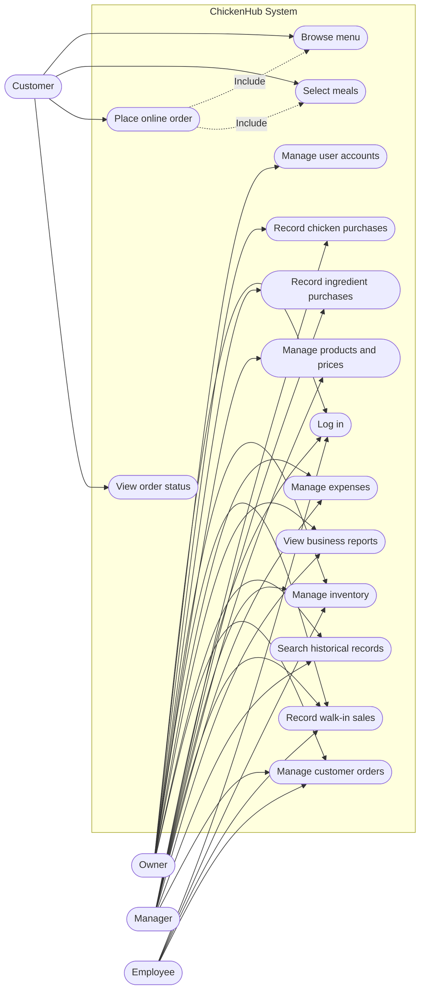

```mermaid
flowchart LR
    Owner([Owner])
    Manager([Manager])
    Employee([Employee])
    Customer([Customer])

    subgraph System["ChickenHub System"]
        UC1([Log in])
        UC2([Manage user accounts])
        UC3([Record chicken purchases])
        UC4([Record ingredient purchases])
        UC5([Manage inventory])
        UC6([Manage products and prices])
        UC7([Record walk-in sales])
        UC8([Manage expenses])
        UC9([View business reports])
        UC10([Search historical records])
        UC11([Manage customer orders])
        UC12([Browse menu])
        UC13([Select meals])
        UC14([Place online order])
        UC15([View order status])
    end

    Owner --> UC1
    Owner --> UC2
    Owner --> UC3
    Owner --> UC4
    Owner --> UC5
    Owner --> UC6
    Owner --> UC7
    Owner --> UC8
    Owner --> UC9
    Owner --> UC10
    Owner --> UC11

    Manager --> UC1
    Manager --> UC3
    Manager --> UC4
    Manager --> UC5
    Manager --> UC6
    Manager --> UC7
    Manager --> UC8
    Manager --> UC9
    Manager --> UC10
    Manager --> UC11

    Employee --> UC1
    Employee --> UC5
    Employee --> UC7
    Employee --> UC11

    Customer --> UC12
    Customer --> UC13
    Customer --> UC14
    Customer --> UC15

    UC14 -.->|Include| UC12
    UC14 -.->|Include| UC13
```